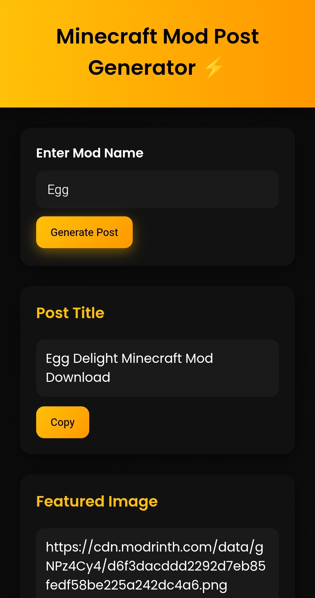
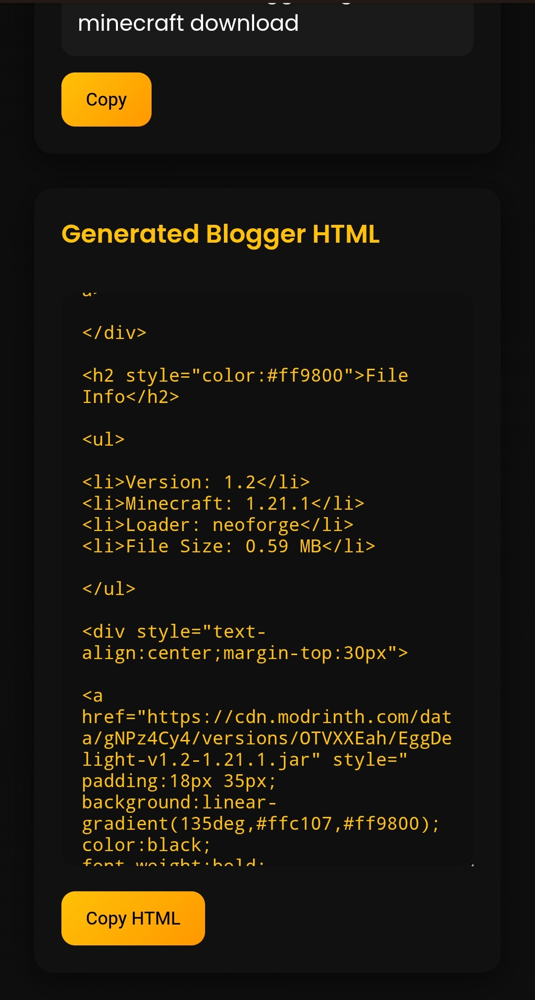
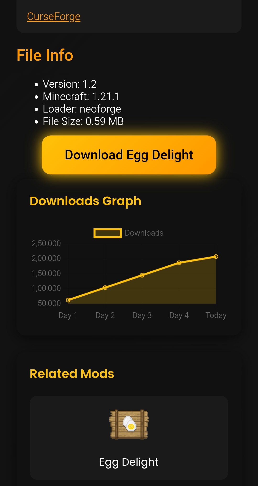
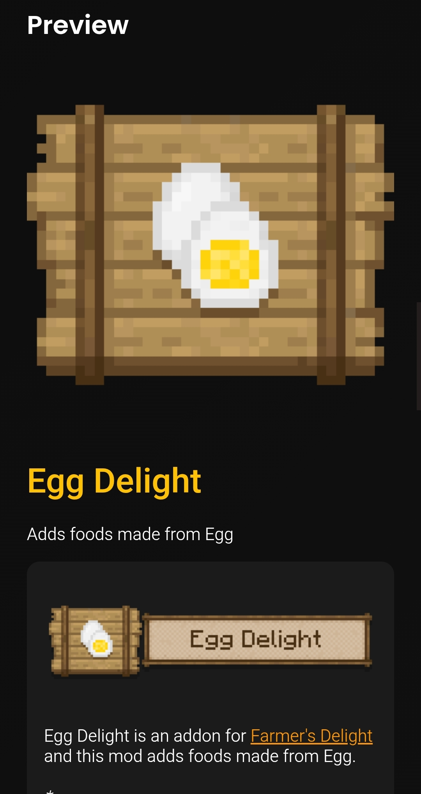

# ⚡ Minecraft Mod Post Generator

---

## 🧠 Overview

**Minecraft Mod Post Generator** is a powerful web tool that automatically generates **ready-to-publish Blogger posts** for Minecraft mods using the **:contentReference[oaicite:1]{index=1}**.

This tool helps content creators quickly generate:

- 📌 SEO optimized titles
- 📄 Meta descriptions
- 🏷️ Keywords
- 🧾 Complete Blogger HTML post
- 🖼️ Featured images
- 📊 Download graphs
- 🔗 Related mod suggestions

Everything is generated automatically from the Modrinth database.

---

# ✨ Features

✔ Automatic Mod Data Fetching  
✔ SEO Title Generator  
✔ Meta Description Generator  
✔ Keyword Generator  
✔ Full Blogger HTML Generator  
✔ Post Preview  
✔ Download Statistics Graph  
✔ Related Mods Suggestions  
✔ Copy-to-Clipboard Buttons  
✔ Mobile Friendly UI  

---

# 🖼️ Project Preview

## Generator Interface

---

## Generated Blog Post Preview

---

## Download Graph

---

# ⚙️ Technologies Used

This project is built using:

- **HTML5**
- **CSS3**
- **JavaScript**
- **:contentReference[oaicite:2]{index=2}**
- **:contentReference[oaicite:3]{index=3}**

---

# 📁 Project Structure

📦 mc-mod-gen  
│  
├──  <b>index.html</b> — Main application interface  
├──  <b>style.css</b> — UI styles and layout  
├──  <b>script.js</b> — JavaScript logic & API calls  
│  
├── 🖼️ <b>preview1.jpg</b> — Generator interface preview  
├── 🖼️ <b>preview2.jpg</b> — Generated blog post preview  
├── 🖼️ <b>preview3.jpg</b> — Download graph preview  
├── 🖼️ <b>preview4.jpg</b> — Related mods preview  
│  
├── 📘 <b>README.md</b> — Project documentation  
└── 📜 <b>LICENSE</b> — MIT License  

---
## 🖼️ Project Preview

### Generator Interface

### Generated Blog Post

### Download Graph

### Related Mods Section

